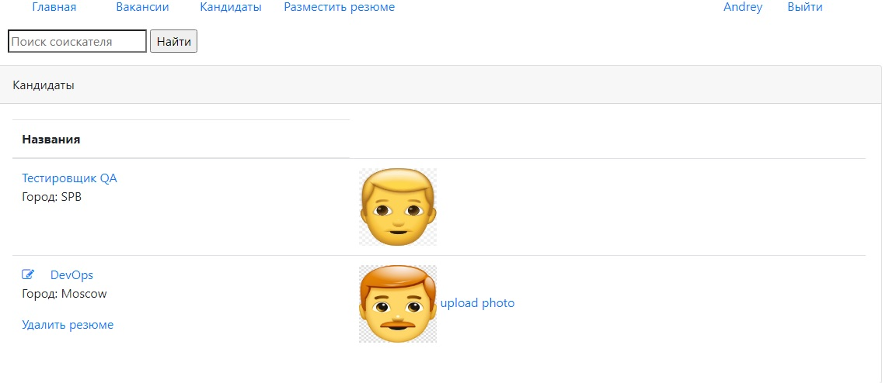

### Описание:
В системе два типа пользователей: кандидаты и кадровики. Кандидаты могут публиковать резюме. Кадровики могут публиковать вакансии о работе.
Кандидаты могут откликнуться на вакансию, кадровик может пригласить на вакансию кандидата по средствам отправки email.
На страницах с вакансиями и резюме реализован поиск.

### Используемые технологии:
- Servlet
- PostgreSQL
- Liquibase
- JSP (JavaServer Pages)
- JSTL (JSP Standard Tag Library)
- Log4j
- Junit
- Mockito

